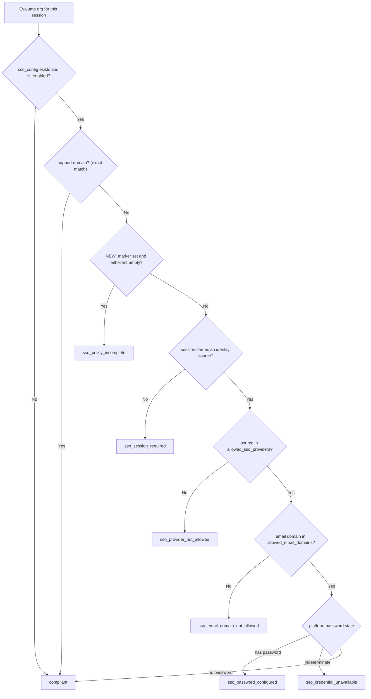
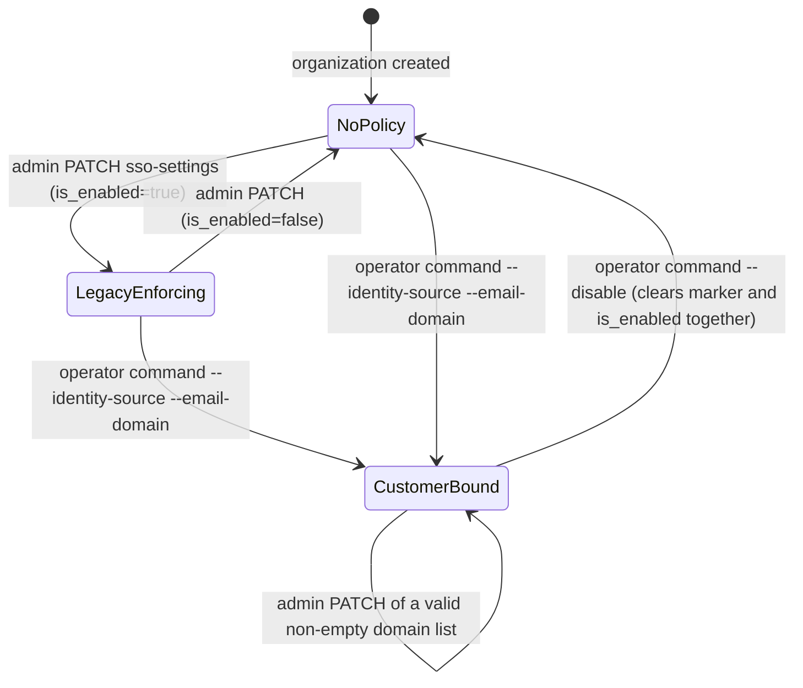

# Phase 1 data model — Enterprise Okta login (Connect slice)

**Feature**: `001-enterprise-okta-sso` | **Date**: 2026-09-01

Decisions are justified in [research.md](./research.md). This document states
the resulting shape, the invariants, and the state transitions.

## Entities

### `OrganizationSSOConfig` (existing — one field added)

`connect/common/models.py`. OneToOne with `Organization`, integer primary key
plus a public `uuid`, so it already conforms to the constitution's model rules.

| Field | Type | Status | Notes |
| --- | --- | --- | --- |
| `id` | `AutoField` | existing | Internal key |
| `uuid` | `UUIDField(unique=True)` | existing | Public identifier |
| `organization` | `OneToOneField(Organization, related_name="sso_config")` | existing | — |
| `is_enabled` | `BooleanField(default=False)` | existing | Enforcement on/off |
| `allowed_email_domains` | `JSONField(default=list)` | existing | List of bare domains, normalized on write |
| `allowed_sso_providers` | `JSONField(default=list)` | existing | List of identity-source values, normalized on write |
| **`requires_customer_identity_source`** | **`BooleanField(default=False)`** | **NEW (R1)** | The marker that scopes the fail-closed rules to this delivery |
| `created_at` / `updated_at` | `DateTimeField(auto_now_add / auto_now)` | existing | `updated_at` must not move on an idempotent re-run (SC-007) |

**Migration**: `connect/common/migrations/0100_organizationssoconfig_requires_customer_identity_source.py`
— a single `migrations.AddField` with `default=False`. **No `RunPython`.** This
is the mechanism by which FR-006 and SC-002 are satisfied: there is no code path
in the migration that could rewrite an existing row's policy, which a reviewer
can confirm by reading it. Contrast with migration `0097`, which carried a
backfill.

**Not added to `OrganizationSSOConfigSerializer.Meta.fields`.** Because that is
a `ModelSerializer` with an explicit field list, the omission makes the marker
neither readable nor writable through `GET`/`PATCH /v1/organization/org/{uuid}/sso-settings/`.
That is the primary enforcement of FR-023 and it also keeps the `sso_config`
payload byte-identical for existing clients (FR-026).

**No index added.** The marker is only ever filtered on in the FR-010
cross-organization check, whose candidate set is the handful of
customer-identity organizations. Adding an index for a single-digit row count
would be cost without benefit.

### `OrganizationSSOPolicyDTO` (new, not persisted)

`connect/usecases/organizations/sso_policy.py`. A `@dataclass(frozen=True)`
carrying the **resulting** policy state, i.e. stored row merged with the
requested change. Both writers build one and hand it to the validator, which is
what makes the invariants path-independent (R4).

```python
@dataclass(frozen=True)
class OrganizationSSOPolicyDTO:
    is_enabled: bool
    allowed_email_domains: List[str]
    allowed_sso_providers: List[str]
    requires_customer_identity_source: bool
```

### Concepts that map to no new storage

| Spec entity | Where it lives | Note |
| --- | --- | --- |
| Customer identity source | A normalized string inside `allowed_sso_providers` | No table. FR-025 requires customer two to be data, not schema |
| Session identity source | `request.session_identity_provider`, read live from the JWT per request | Never persisted for decision-making. The append-only `UserIdentityProvider` history is explicitly **not** consulted |
| Support domain | `settings.SSO_INTERNAL_BYPASS_EMAIL_DOMAINS` (default `["weni.ai", "vtex.com"]`) | Config, per the spec's assumption that the values remain configurable |
| Platform password state | Keycloak, read through `KeycloakCredentialsService` (positive results cached) | Three-valued: `True` / `False` / `None`; `None` denies |
| Organization authorization | Existing `OrganizationAuthorization` | Untouched. FR-013 requires that authentication never create one |

## Invariants owned by `ValidateOrganizationSSOPolicyUseCase`

Enforced on the **resulting** state, identically for the operator path and the
admin path. Violations raise `SSOPolicyValidationError` with nothing persisted.

| # | Invariant | Requirements |
| --- | --- | --- |
| **I1** | Every entry of `allowed_sso_providers` matches `^[a-z0-9]+(-[a-z0-9]+)*$`, at most 63 characters, after lowercasing and trimming | FR-003, FR-009 |
| **I2** | Every entry of `allowed_email_domains` is a bare domain after lowercasing and trimming: non-empty, no `@`, no whitespace, no wildcard, at least one dot | FR-009 |
| **I3** | `requires_customer_identity_source` implies `is_enabled` **and** `allowed_sso_providers` non-empty **and** `allowed_email_domains` non-empty | FR-005 (write half), FR-007, **FR-024** |
| **I4** | No other `OrganizationSSOConfig` with `requires_customer_identity_source=True` shares a domain unless its normalized identity-source set is **equal** to this one's | FR-010 |

**I3 is why FR-024 needs no path-specific code.** An admin write that turns
enforcement off on a marked organization produces a state where the marker is
set and `is_enabled` is false, which I3 rejects as an invalid state. There is no
second place the rule could be forgotten. The operator's disable operation
therefore has to clear the marker and `is_enabled` **in the same save**.

**I4 excludes the organization being written** (`.exclude(organization_id=organization.pk)`).
Without that exclusion a re-run would find the organization's own domains
already claimed and reject itself, breaking FR-019 — a failure that only appears
on the second run. "Different identity source" is defined as set inequality;
the trade-off is argued in R6.

**Normalization is part of validation, not a separate step.** The validator
returns the normalized DTO and callers persist *that*, so a stored value can
never disagree with what was validated. This matters because
`is_provider_allowed` compares with a case-sensitive `in`, so an unnormalized
write produces a policy that silently admits nobody.

## Evaluation order

`EvaluateOrganizationSSOAccessUseCase.evaluate` after this delivery. Only the
bracketed step is new (R3); every other step keeps its current position, so a
row with `requires_customer_identity_source=False` traverses exactly today's
path.



Two consequences of this placement:

- **The support bypass precedes the incomplete-policy refusal.** This is a
  deliberate, contestable choice, argued in R3: an incomplete policy is
  unreachable through supported writes, and letting it lock out support staff
  is exactly the lockout US3 exists to prevent.
- **The new branch precedes the Keycloak lookup**, so an incomplete policy costs
  zero credential calls and cannot weaken FR-014's indeterminate-state denial.

The model methods `is_provider_allowed` and `is_email_domain_allowed` keep their
current bodies, including `return True` on an empty list. Emptiness is decided
in the use case; the model is not taught the new rule (R3).

## State transitions

An organization's policy occupies one of four states. The marker only ever
moves through the operator path.



| State | `is_enabled` | marker | Lists | Evaluation |
| --- | --- | --- | --- | --- |
| **NoPolicy** | `false` | `false` | any | Always compliant |
| **LegacyEnforcing** | `true` | `false` | may be empty | **Unchanged from today** — empty list means "allow any" |
| **CustomerBound** | `true` | `true` | both non-empty (I3) | Fail-closed; only the named customer source admits |
| *Marked but incomplete* | `true` | `true` | either empty | **Unreachable through any supported write.** Reachable only by direct database editing; denies with `sso_policy_incomplete` |

Transitions **forbidden by design**, each with its enforcement:

| Forbidden transition | Blocked by | Requirement |
| --- | --- | --- |
| Admin sets or clears the marker | Marker absent from serializer `fields`; absent from `UpdateOrganizationSSOConfigDTO`; never assigned by the admin use case | FR-023 |
| Admin turns enforcement off on a CustomerBound organization | Invariant I3 | FR-024 |
| Admin empties either list on a CustomerBound organization | Invariant I3 | FR-005, FR-022 |
| Operator enables while either list is empty | Invariant I3 | FR-007 |
| Any write storing a malformed domain or identity-source value | Invariants I1, I2 | FR-003, FR-009 |
| A second organization claiming a domain under a different source | Invariant I4 | FR-010 |
| A migration changing any LegacyEnforcing or NoPolicy row | Migration `0100` contains no `RunPython` | FR-006 |

## Refusal reason vocabulary

`OrganizationSSOAccessDisabledReason`. One value added; the five existing values
keep their meaning and their string, so the change is purely additive (SC-012).

| Value | Status | Meaning |
| --- | --- | --- |
| `sso_session_required` | existing | No identity source on the current session |
| `sso_provider_not_allowed` | existing | Session's source not in `allowed_sso_providers` |
| `sso_email_domain_not_allowed` | existing | Member's email domain not in `allowed_email_domains` |
| `sso_password_configured` | existing | Member holds a platform password |
| `sso_credential_unavailable` | existing | Password state could not be determined |
| **`sso_policy_incomplete`** | **NEW (R7)** | Marked organization with an incomplete policy — a platform misconfiguration, not a session problem |

All six name no provider, no customer and no other tenant's configuration
(FR-027, FR-029). `sso_policy_incomplete` is logged at `warning` with the
organization, the member and the resolved identity source, which is what makes
it distinguishable from a session refusal for support (FR-028, SC-011).
